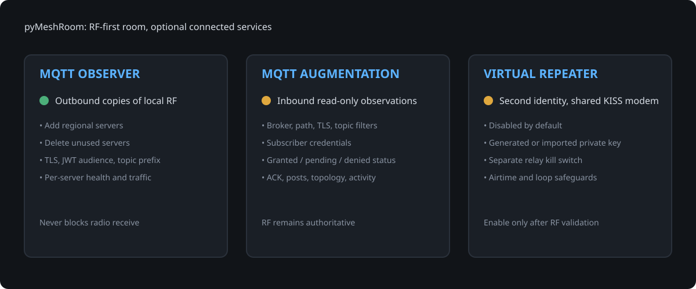
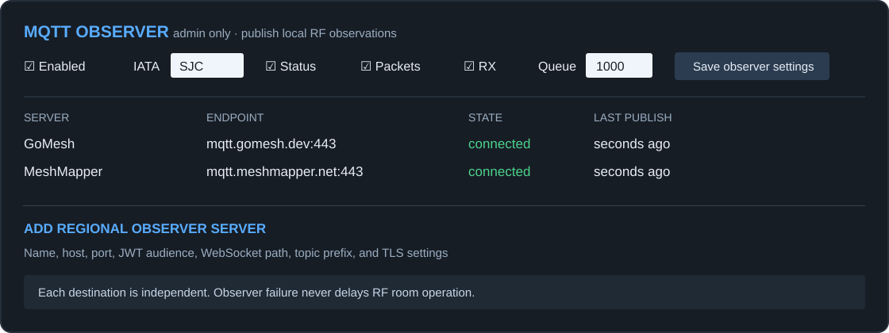
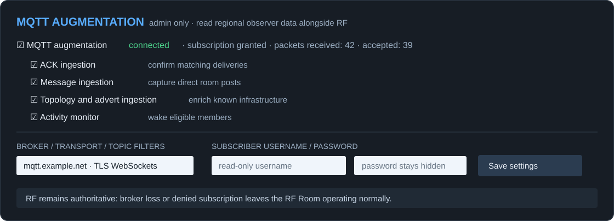
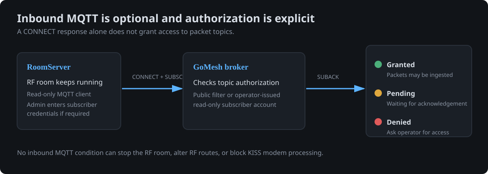
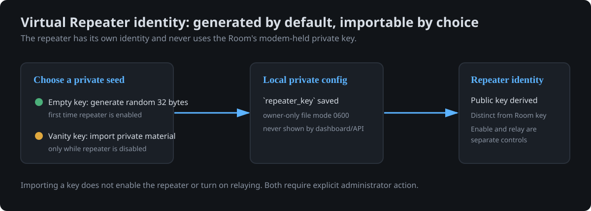

# pyMeshRoom

MeshCore Room firmware running on basic nodes is too limiting for active, high-traffic rooms. **pyMeshRoom** is an RF-first persistent MeshCore Room Server with optional MQTT augmentation, MQTT observation, and Virtual Repeater capabilities.

> **Runs beyond the Raspberry Pi.** pyMeshRoom can run on any Linux computer that runs Python 3 and provides USB or serial access to a KISS-capable MeshCore modem. A Raspberry Pi is a convenient deployment target, not a requirement. The modem is the RF component; the Linux computer runs the room server.

## Executive summary

**Build a dependable MeshCore Room on Linux without making the mesh dependent on the internet.** The Pi and KISS modem remain the RF authority; every internet-connected capability is optional, independently switchable, and fails safely.



| Capability | What it does | Default |
| --- | --- | --- |
| RF Room Server | Persistent room, routing, delivery planning, map, dashboard, and admin tools. | On |
| MQTT Observer | Publishes copies of locally received RF packets to one or more regional MeshCore observer brokers. | Off |
| MQTT Augmentation | Read-only inbound MQTT observations can confirm deliveries and enrich map/activity data. | Off |
| Virtual Repeater | A separate optional repeater identity sharing the room's KISS modem and TX scheduler. | Off |

### The three optional subsystems

**MQTT Observer — outbound.** Add or delete regional standard MeshCore observer servers from the admin card. Each one has its own endpoint, JWT audience, WebSocket path, topic prefix, TLS controls, health state, and traffic counters. A failed observer never blocks RF.

**MQTT Augmentation — inbound.** Configure the regional broker, TLS, topic filters, and read-only credentials in the admin card. The dashboard distinguishes a successful connection from an actually granted MQTT subscription. RF routing remains authoritative.

**Virtual Repeater — RF.** Give the Pi a second MeshCore identity without a second serial connection. It is disabled by default; relaying has its own immediate kill switch. Use a generated key or import a previously created vanity private key while disabled.

Read the installation guide below to build an instance, then enable only the optional components you actually need.

**Jump to:** [install and first configuration](#first-configuration) · [MQTT Observer](#outbound-mqtt-observer) · [MQTT Augmentation](#inbound-mqtt-ingestion) · [Virtual Repeater](#optional-virtual-repeater) · [dependencies](#dependencies)

See stats and what repeaters the room is well connected to

See a member list, with click-to-expand to get more details


Users who don't respond get moved to a suspended category.  Once a packet from them is seen on the mesh the room will resume sync

Repeater map with details populated from RF and mqtt data

Repeater list with best percieved routes from the room

Admin console with mqtt/flood options and chat box that accepts input to speak to the room

Admin buttons to force resync, suggest path, kick, or ban.


# Why current rooms suck
Microcontrollers running Meshcore have limited resources that cannot scale to rooms with more than a few members over small numbers of hops:
* Limited memory
   * One route per member, no map of the mesh.
   * One route, then flood
   * Fastest path wins, not best.
   * New members have no route data.
* Limited cpu
   * One loop for everything, grinds to a halt as members join
   * Packets lost if not read from the radio quickly enough
* No persistence - reboots are devastating.
   * Clock is reset
   * Message queue is lost
   * Users states lost, and users are logged out
Usability:
* No insight into what the room is doing
* No admin tools

# Why meshroom (Linux + KISS modem) is better
Core functionality fixed:
* Radio is a dedicated KISS modem, and can focus on sending and receiving packets
* Much better persistence using storage instead of memory
   * SQLite databases for members, posts, sync states, routes, and shared secrets
* More robust core functionality with passive mesh monitoring/mapping for better message delivery
   * Time via linux host (NTP)
   * A map of the mesh, learned from every packet heard (2/3-byte IDs only), so the room can build routes it was never told
   * Multiple routes per member with recency-weighted success rates, trying alternates before flood fallback
   * A planned attempt order: best route, alternate, best again, next, flood; then backoff and give-up, instead of fixed retries
   * Newcomers reached direct on the first push: the companion directory knows where they are before they join by passively monitoring the mesh
   * Route shortcuts: unneeded hops are skipped when the room reaches a repeater directly, confirmed both ways
   * Adaptive push gaps sized from each route's measured ACK time; the ACK itselfends the wait, and flood gaps end once the rebroadcast wave passes
   * Learned ACK timeouts per route, instead of a fixed formula.
   * Extra ACK over a second route, so a single repeater's miss can't lose it
   * Late ACKs still count, crediting the route and stopping retries
   * Rounds ordered by delivery score: reliable members aren't held up behind struggling ones
   * Radio is never blocked: dedicated reader, database, and web threads
   * Duplicate re-sends caught: a member re-sending the same text is sent an ACK, but the message not reposted.
   * Fair catch-up: new members get the last few posts, returning members get recently missed messages
   * Takes part in traces that name the room as a hop.
   * Radio settings enforced: re-applied automatically if the modem reboots and reverts.
* Optional MQTT integration
   *Passively listen to gomesh.dev to capture topology, ack, and incoming room messages to speed up message distribution, with RF fallback   

# Additional useful features:
* Web dashboard, public to view with an admin login, and isolated so it can't slow the radio.
   * Members table: delivery score, current TX/RX routes, and up to 5 alternates each way.
   * Repeater map with links, and a detail pane for every repeater (key, position, routes, neighbors with SNR).
   * Best-neighbor table: discovery every 15 minutes plus idle-time traces, ranked by packet loss, with SNR both ways.
   * Stats: CPU and memory (now and 10-minute average), modem voltage, noise floor, channel use, packets/min, and pushes/min with delivery %.
   * Admin tools: resync, route suggestions with autocomplete, kick, ban/unban, and a chat box that posts as the room.
   * Messages: configurable welcome (with an advert reminder), plus kick/ban notices.
   * Passively collects SNR and Route data from traces as they pass by.

# Core capability detail

This branch keeps the normal MeshRoom RF/KISS room server as the authority for room state, routing, acknowledgements, and transmission.  It adds optional MQTT features around that RF path; it does not add a second owner for the serial modem.

## Outbound MQTT observer



The Observer card is an admin-only, outbound control surface. It is intentionally separate from MQTT Augmentation: it publishes copies of RF traffic and never needs inbound subscription access.

When `observer_enabled` is true, the observer makes a non-blocking copy of locally received RF packets and publishes them independently to GoMesh and/or MeshMapper over TLS WebSockets.  It provides:

* modem-backed identity signing; the MeshCore private key stays in the modem;
* independent GoMesh and MeshMapper connections, diagnostics, retained online/offline status, and reconnect handling;
* admin-only controls for observer enablement, IATA, packet/status reporting, RX reporting, brokers, and queue size;
* a bounded outbound queue, dropped-observation count, and local-RF traffic statistics; and
* a dashboard section below the repeater map for observer settings and broker health.

Only packets physically received through the KISS modem count as local RF traffic.  MQTT data never changes the RF RX counters or borrows local RSSI/SNR values.

## Inbound MQTT ingestion



The Augmentation card is an admin-only, inbound control surface. It controls what the room may read from a regional MQTT service; it does not alter RF routing, own the modem, or make internet connectivity a requirement.

When `mqtt_enabled` is true, a separate native Python MQTT/WebSocket subscriber listens to the configured GoMesh topics.  It can supplement, but never replace, RF operation by ingesting:

* matching ACKs for delivery confirmation;
* direct room packets addressed to this room;
* repeater/companion adverts and map enrichment;
* observed topology links between already-known repeaters; and
* selected channel activity to wake an otherwise suspended member.

Remote ACKs can mark a matching delivery complete, but route scoring and pacing credit remain reserved for a subsequent local RF ACK.  Remote topology is not used as a transmission route.  Retained MQTT packets, malformed data, duplicates, and observations whose `origin_id` is this room's own public key are ignored.  That last rule prevents the room from consuming its own outbound observer publications as new inbound traffic.

## Why the newest ingress event is ignored when the queue is full

Inbound MQTT events first enter a FIFO queue controlled by `mqtt_queue_max`, which defaults to **1000**.  The queue protects the radio and the main RoomServer event loop from an MQTT burst.  Radio and dashboard events are processed before a bounded slice of queued MQTT events.

If all 1000 positions are occupied, the **newly arriving** MQTT event is ignored and the `dropped` counter is incremented.  The oldest queued event is deliberately retained: it was already accepted in order and may be an ACK or direct room packet.  Discarding the oldest event could preserve later observations while losing an earlier event they logically follow.  This chooses delivery-state correctness and FIFO ordering over retaining the most recent map/activity update.  The queue depth, configured limit, and ignored-event count are exposed through the MQTT dashboard/API state.

## Dashboard and configuration

Observer publishing and MQTT ingestion use distinct settings and state:

* `observer_*` controls outbound local-RF reporting to GoMesh/MeshMapper.
* `mqtt_*` controls inbound remote-MQTT ingestion, including `mqtt_queue_max`.

Both are disabled by default and are controlled from separate admin-only dashboard sections.  Welcome-DM controls and observer controls remain below the repeater map.

# Installation/usage
Install
* Clone repo to a linux machine that has a KISS meshcore modem connected via USB.
* Make a copy of meshroom.json.example to meshroom.json and edit:
   * system: Update data dir to reflect the data subpath from your git clone
   * room: Set name and coordinates
   * access: Set room join password and room admin password
   * radio: Set USB interface and params for your region
   * dashboard: Set web UI admin password
   * observer: Leave `observer_enabled` false unless MQTT observation is wanted. To enable it, install `python3-paho-mqtt`, use IATA `SJC` for this deployment, and keep `identity` set to `modem`; the modem signs the MQTT token and the private key is never copied to the Pi. `observer_status` controls retained online/offline status messages on `meshcore/<IATA>/<public-key>/status`. Packet observations publish to `meshcore/<IATA>/<public-key>/packets` only when both `observer_packets` and `observer_rx` are true; they are compatibility gates for the same RX-only packet path, not independent packet types.
* Usage
   * Run ```python3 meshroom.py --config meshroom.json```
* Updating:
   * Stop meshroom
   * Clone again
   * Start meshroom

# pyMeshRoom: build your own instance

## What you need

* A Linux host (a Raspberry Pi 4 or newer is a practical choice), Python 3, Git, and a MeshCore KISS modem attached by USB.
* A modem serial device such as `/dev/ttyUSB0`; the service user needs read/write permission, normally through the `dialout` group.
* A stable storage directory for the SQLite room database.
* Optional internet access only if you enable MQTT features or host the dashboard remotely. RF Room Server and Virtual Repeater functions do not require internet.

Create a virtual environment and install the core packages:

```bash
python3 -m venv .venv
.venv/bin/python -m pip install --upgrade pyserial cryptography
```

Add `paho-mqtt` only when enabling the outbound MQTT observer:

```bash
.venv/bin/python -m pip install --upgrade paho-mqtt
```

## First configuration

### One-command bootstrap (recommended)

After cloning this branch, use the installer script to create a virtual environment, install the complete Python dependency set, create a protected private configuration if it does not yet exist, make a local data directory, validate JSON, and run the automated tests:

```bash
./scripts/install-pymeshroom.sh
```

It **never overwrites** an existing `meshroom/meshroom.json`. The new configuration starts RF-first: MQTT Observer, MQTT Augmentation, Virtual Repeater, and repeater relaying are disabled. Edit its room name, serial device, coordinates, passwords, and dashboard settings before starting a live modem.

For a systemd installation after reviewing the generated configuration, use:

```bash
./scripts/install-pymeshroom.sh --service
```

If a `meshroom.service` already exists, the installer deliberately refuses to replace it. Review the existing deployment and use `--service --replace-service` only when you explicitly want this checkout to become the systemd service. Run `./scripts/install-pymeshroom.sh --help` for data-directory, config-path, service-user, and test options.

Clone the selected branch, create the private configuration, and verify it before touching the modem:

```bash
git clone https://github.com/Sextant/pyMeshRoom.git pyMeshRoom
cd pyMeshRoom
python3 -m venv .venv
.venv/bin/python -m pip install --upgrade pyserial cryptography
cp meshroom/meshroom.json.example meshroom/meshroom.json
chmod 600 meshroom/meshroom.json
.venv/bin/python -m json.tool meshroom/meshroom.json >/dev/null
```

Edit the private `meshroom/meshroom.json` and set the room name, coordinates, serial device, radio parameters, data directory, passwords, and dashboard bind address. Never commit that file: it can contain passwords, MQTT credentials, and a locally generated Virtual Repeater key.

Start with every optional feature disabled:

```json
"mqtt_enabled": false,
"observer_enabled": false,
"repeater_enabled": false
```

This is the recommended initial installation. Confirm normal RF room operation before enabling any optional feature.

Run it manually for the first hardware test:

```bash
cd meshroom/meshroom
../.venv/bin/python meshroom.py --config meshroom.json
```

For a persistent Raspberry Pi deployment, create `/etc/systemd/system/meshroom.service` (adjust both paths and the serial device/configuration before enabling it):

```ini
[Unit]
Description=MeshRoom RF-first Room Server
Wants=network-online.target
After=network-online.target

[Service]
Type=simple
User=YOUR_USER
Group=YOUR_USER
SupplementaryGroups=dialout
WorkingDirectory=/home/YOUR_USER/meshroom/meshroom
ExecStart=/home/YOUR_USER/meshroom/.venv/bin/python meshroom.py --config meshroom.json
Restart=on-failure
RestartSec=10
TimeoutStopSec=30

[Install]
WantedBy=multi-user.target
```

Then enable it:

```bash
sudo systemctl daemon-reload
sudo systemctl enable --now meshroom.service
systemctl --no-pager --full status meshroom.service
```

Run all automated tests before upgrading a live instance:

```bash
.venv/bin/python -m unittest discover -s tests -v
```

Install `paho-mqtt` before enabling the optional outbound MQTT Observer:

```bash
.venv/bin/python -m pip install --upgrade paho-mqtt
```

## Optional MQTT

`mqtt_enabled` activates inbound supplemental observations. It can improve ACK confirmation, activity awareness, advert/map data, and topology awareness, but it never replaces RF routing or makes the Room Server dependent on a broker. Broker loss is reported in dashboard status and the RF room keeps operating.

### GoMesh inbound subscriber access

Inbound MQTT is separate from outbound observer publishing. An observer can publish a modem-signed local-RF observation while inbound MQTT remains unavailable. For inbound access, the RoomServer opens a read-only MQTT/WebSocket connection and requests the configured topic filter. A successful connection is **not** proof that the topic was authorized: the broker must grant the MQTT `SUBACK` response before packets can arrive.



Some GoMesh installations may permit a public topic filter; others require a broker operator to issue a read-only subscriber username and password or to name an approved topic filter. The MQTT Augmentation admin card makes the **broker host**, **port**, **transport**, **WebSocket path**, **TLS settings**, and one or more comma-separated **topic filters** configurable. Its **Subscriber username**, **Subscriber password**, and **Save subscriber credentials** controls handle read-only access without putting secrets in the browser-visible status.

1. Obtain the broker endpoint, transport/TLS requirements, read-only credentials if required, and approved topic filter(s) from the broker operator.
2. Log into the dashboard as an administrator and open **MQTT Augmentation**. Set and save the broker/topic controls first.
3. If required, enter both subscriber fields and select **Save subscriber credentials**. Each save reconnects the inbound client immediately; RF service and outbound observer publishing continue independently.
4. Check the card status. It reports **subscription granted**, **subscription awaiting broker acknowledgement**, or **subscription denied**. The received and accepted MQTT counts provide the next confirmation that inbound data is flowing.

The password is write-only: it is saved in the owner-protected local configuration and is never returned by the dashboard/API or shown after it is saved. Keep the configuration file mode at `0600`. The project does not ship GoMesh credentials.

### MQTT Augmentation admin form reference

All fields below are for **inbound** MQTT augmentation. They do not change the outbound Observer card, the Room identity, RF routing, or the KISS modem settings. Start with the broker operator's values; the defaults are an example GoMesh-compatible WebSocket endpoint, not a promise of anonymous access in every region.

| Admin field | What to enter | Safe starting value / notes |
| --- | --- | --- |
| MQTT augmentation | Enable only after the connection settings are saved. | Off by default. Turning it off stops only inbound MQTT. |
| Broker host | Broker DNS name or IP address, without `mqtt://` or `wss://`. | `mqtt.gomesh.dev` for the GoMesh example. |
| Port | The broker's MQTT or MQTT-over-WebSocket port. | `443` for TLS WebSockets; use the operator's value otherwise. |
| Transport | `WebSockets` or `TCP`. | `WebSockets` for the GoMesh example. |
| WebSocket path | The path supplied by the broker operator. | `/mqtt` for the GoMesh example. It is unused with TCP. |
| TLS / Verify TLS certificate | Enable TLS when the broker supports it; leave certificate verification enabled for a public broker. | Both enabled for the GoMesh example. Disable verification only for a deliberately trusted private/self-signed deployment. |
| Topic filter(s) | One or more MQTT subscription filters, separated with commas. | Use the operator-approved filter. `meshcore/#` is only a broad example; a region such as `SJC` is not portable to another installation. |
| Subscriber username / password | The read-only credentials issued by the broker operator. Enter both fields together. | They are write-only and never appear in the status API or after page reload. |
| ACK, Message, Topology, Advert, Activity ingestion | Choose which accepted MQTT packets can augment local room state. | All are enabled by default when MQTT augmentation is enabled. Disable a category if it is not useful to your deployment. |

After saving broker/topic fields or credentials, the inbound client reconnects automatically. Do not judge success only by the word **connected**: look for **subscription granted** and nonzero MQTT packets received over time. **Subscription denied** means the broker rejected the exact requested topic filter; verify the filter or obtain credentials.

`observer_enabled` copies locally received RF packets to GoMesh and/or MeshMapper. It uses the modem-backed Room identity for signing; the Room private key never leaves the modem. Its `observer_queue_max` limits asynchronous outgoing observations. MQTT ingestion has its own `mqtt_queue_max` ingress limit, default 1000. If it is full, the newest remote event is ignored rather than evicting an already accepted older ACK or direct packet; FIFO delivery-state ordering is safer than keeping a fresher topology update.

### Outbound observer servers

The **MQTT Observer** admin card manages the destinations for copies of locally received RF packets. Existing installations begin with GoMesh and MeshMapper as compatible defaults. The first server-list save makes the displayed list authoritative, so a server can be deleted when it is no longer wanted. Adding a regional destination requires that it implement the standard MeshCore observer protocol: modem-signed JWT authentication and packet/status topics shaped as `<topic prefix>/<IATA>/<room public key>/packets` and `.../status`.

| Server field | Purpose |
| --- | --- |
| Name | A local dashboard label. |
| Host / Port | The regional MQTT-over-WebSocket endpoint. |
| Audience | The JWT `aud` value expected by that broker; normally its host name. |
| Path | MQTT WebSocket path, often `/` or `/mqtt`; obtain it from the regional operator. |
| Prefix | Topic root, normally `meshcore`. |
| Enabled | Stops this destination only; other observer servers continue. |
| TLS / Verify TLS | Use TLS for public deployments and leave verification enabled unless the regional operator has supplied a trusted private/self-signed setup. |

Add a server only after obtaining its endpoint and protocol details from the regional operator. The observer status and Traffic Statistics cards report each destination independently. A disconnected or failed server never blocks KISS receive processing, RF Room operation, or publishing to another enabled observer server.

## Optional Virtual Repeater

`repeater_enabled` creates a second logical MeshCore identity using the existing RoomServer KISS reader/writer and TX scheduler. It does not open a second serial connection. On first enable, a random repeater key is generated and saved only to the private local configuration; use `chmod 600` on that file.



### Default key or imported vanity key

If `repeater_key` is empty, enabling the Virtual Repeater creates a cryptographically random 32-byte private seed, derives its public key, and saves the private seed in the local `meshroom.json`. This is the default identity; it is separate from the Room identity, and it is stable across restarts because it is saved after creation.

If you already generated a matching private key for a vanity public key elsewhere, import it through the **Virtual Repeater** admin card:

1. Disable the Virtual Repeater first. Key replacement is deliberately rejected while it is running.
2. Paste the private material into **Import private key** and select **Import key**. The accepted form is 64 hexadecimal characters (a 32-byte seed) or 128 hexadecimal characters (a 64-byte private-key representation).
3. The dashboard validates the material, saves it locally, clears the browser input, and leaves the repeater disabled. Review the derived public identity after re-enabling it.

The RoomServer does not search for vanity keys and never exports a private key through the dashboard or status API. Preserve an encrypted offline backup of the private configuration before replacing a key. `repeater_relay` remains a separate relay kill switch: a repeater may advertise while forwarding is off.

`repeater_relay` is an independent immediate relay kill switch. When false, the repeater may advertise but relays no packets. Configure its name, coordinates, scoped regions, advert intervals, airtime cap, and loop-detection mode through the admin dashboard. Keep it disabled until RF validation is explicitly planned.

## Operations, upgrades, and rollback

Run the included unit tests before touching a live modem:

```bash
.venv/bin/python -m unittest discover -s tests -v
```

Use a separate checkout and virtual environment for any upgrade test. Never run two MeshRoom processes against the same serial modem. Keep a known-good checkout and systemd override rollback path. If an optional MQTT component fails, disable it in the dashboard or configuration; core RF operation continues. If Virtual Repeater behavior is unwanted, set `repeater_relay` false or `repeater_enabled` false and restart cleanly.

# Dependencies

The core room server requires:

* Linux with Python 3, a KISS-capable MeshCore modem, and serial-device permission (normally membership in `dialout`);
* `pyserial` for the USB/KISS connection; and
* `cryptography` for MeshCore packet cryptography and identity operations.

The optional outbound MQTT observer additionally requires:

* `paho-mqtt` (tested here with version 2.1.0) for signed publishing to GoMesh and MeshMapper.

The optional inbound MQTT ingestion uses only Python's standard library for MQTT, TLS, and WebSockets; it does **not** require an additional MQTT package. It needs network access to the configured broker (the default is `mqtt.gomesh.dev:443` with TLS WebSockets). If the broker requires read-only subscriber authorization, configure it through the admin controls or the private `mqtt_username` and `mqtt_password` settings. The dashboard’s `SUBACK` status—not merely “connected”—confirms whether the broker accepted the topic filter.
